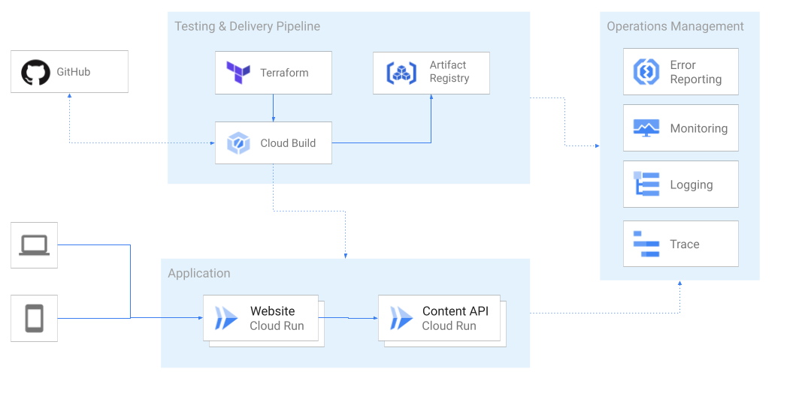

# 💠 Emblem Giving

Emblem Giving is a sample application intended to demonstrate a complex, end-to-end serverless architecture. It showcases serverless continuous delivery as a donation sample app hosted on Google Cloud.   

> This sample application is for learning purposes only. Real financial transactions are not made. The giving campaigns in the app are not real.

## Features

This project features:
  * 2-tier web application architecture with Cloud Run
  * continuous delivery with Cloud Build
  * Terraform deployment
  * Example configuration and usage of the following Google services and apis:
    * Cloud Run
    * IAM
    * Secret Manager
    * Cloud Storage
    * Cloud Firestore
    * Cloud Build
    * Artifact Registry
    * Pub/Sub

Go deeper into project details in the [documentation](./docs) or read through the [technical decisions](docs/decisions/README.md) that got us where we are today.

## Service architecture



## Project Status

* **Release Stage:** Alpha
* **Self-service / Independent Setup:** Follow the instructions to set up Emblem in the [Getting Started](#getting-started) section below. 

## Contributing

* Become a [CONTRIBUTOR](./CONTRIBUTING.md)!
* Check out our shovel-ready [Good First Issues](https://github.com/GoogleCloudPlatform/emblem/issues?q=is%3Aissue+is%3Aopen+sort%3Aupdated-desc+label%3A%22good+first+issue%22) or go a bit deeper in [Help Wanted](https://github.com/GoogleCloudPlatform/emblem/issues?q=is%3Aissue+is%3Aopen+sort%3Aupdated-desc+label%3A%22help+wanted%22)

## Getting Started

Emblem is made of a combination of resources created and managed by Terraform and resources created via the Google Cloud CLI or Google Cloud Console. You may deploy Emblem by running `setup.sh` (see [streamlined setup instructions](#streamlined-setup)). 

### Prerequisites

To deploy Emblem, you will need:
  * 3 Google Cloud projects (ops, stage, prod) with billing enabled on each
  * A fork of this repo

The machine that you will run the setup from will need the following installed:
  * [Google Cloud CLI](https://cloud.google.com/sdk/docs/install)
  * [Terraform](https://learn.hashicorp.com/tutorials/terraform/install-cli)
  * [Python3](https://www.python.org/downloads)

We recommend running through setup steps using Google Cloud Shell, which has the required softare pre-installed. The following will open Cloud Shell Editor and clone this repo:

 [](https://ssh.cloud.google.com/cloudshell/editor?cloudshell_git_repo=https%3A%2F%2Fgithub.com%2FGoogleCloudPlatform%2Femblem&cloudshell_tutorial=docs%2Ftutorials%2Fsetup-walkthrough.md)

### Streamlined setup

1. **Connect a fork of this Github repo to your Emblem ops project**
   
   Connect your repository to your Google Cloud Project via the [Cloud Build triggers page in the Google Cloud Console](https://console.cloud.google.com/cloud-build/triggers/connect). Make sure you are working from your **ops** project. This will require you to enable the Cloud Build API and authenticate with your Github account.

   ```
   gcloud services enable cloudbuild.googleapis.com
   ```

   Principals with access to your Google Cloud project will be able to create and run triggers on the repository you use.

1. **Set environment variables** 

   The streamlined setup uses `setup.sh` to deploy Emblem resources via Terraform and the `gcloud` CLI.

   Create three environment variables (PROD_PROJECT, STAGE_PROJECT, OPS_PROJECT) with their respective project id's.
   
   ```
   export PROD_PROJECT=<YOUR_PROD_PROJECT_ID>
   export STAGE_PROJECT=<YOUR_STAGE_PROJECT_ID>
   export OPS_PROJECT=<YOUR_OPS_PROJECT_ID>
   ```

1. **Execute setup.sh**

   The setup will do the following:

   1. Create a GCS bucket that will be used to store remote Terraform state files
   1. Run `terraform apply` from each of the environment root directories in `terraform/environments/`
   1. Build and push `content-api`, `web`, and `runner` containers to the Artifact Registry repositories in your ops project
   1. Seed sample data into the Firestore instances in your staging and prod projects
   1. Deploy Cloud Run services for `content-api` and `website` in your stage and prod projects
 
   You will be prompted to enter the URL for the Github repository you added to your ops project in step 1. This will be used to deploy Cloud Build triggers for the CICD pipeline. To begin setup:
   ```
   ./setup.sh
   ```

   Once complete you will have a deployed instance of Emblem.

   To see which Google services and apis got installed in your projects, check out below:

   ```mermaid
   stateDiagram
       Operations --> Staging
       Operations --> Production

       state Operations {
         state "IAM" as a0
         state "Secret Manager" as a1
         state "Cloud Build" as a2
         state "Artifact Registry" as a3
         state "Cloud Firestore" as a4
         state "Cloud Scheduler" as a5
         state "Pub/Sub" as a6
       }

       state Staging {
         direction LR
         state "Cloud Firestore" as b0
         state "Cloud Storage" as b1
         state "Cloud Run" as b2
         state "Cloud Logging" as b3
       }

       state Production {
         direction LR
         state "Cloud Firestore" as c0
         state "Cloud Storage" as c1
         state "Cloud Run" as c2
         state "Cloud Logging" as c3
       }
   ```
---

This is not an official Google project.
