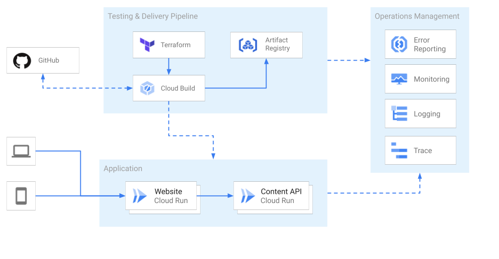

# 💠 Emblem Giving
---
## 🚧 THIS PROJECT IS IN ALPHA STAGE 🏗️
---

Emblem Giving is a sample application intended to demonstrate a complex, end-to-end serverless architecture. It showcases serverless continuous delivery as a donation sample app hosted on Google Cloud.   

> This sample application for learning purposes only. Real financial transactions are not made. The giving campaigns in the app are not real.

## Project Status

* **Release Stage:** Alpha
* **Self-service / Independent Setup:** Follow the instructions to set up Emblem by reading the [setup quickstart](./docs/tutorials/setup-quickstart.md), or by launching the [Interactive Walkthrough](https://ssh.cloud.google.com/cloudshell/editor?cloudshell_git_repo=https%3A%2F%2Fgithub.com%2FGoogleCloudPlatform%2Femblem&cloudshell_tutorial=docs%2Ftutorials%2Fsetup-walkthrough.md) on Cloud Shell.

## Learn About This Project

* This project will help you learn about:
  * 2-tier web application architecture with Cloud Run
  * Continuous Delivery with Cloud Build
  * Using Terraform to manage Google Cloud resources
  * Making sustainable decisions on Cloud usage for a team
* See products in use: Cloud Run, IAM, Secret Manager, Cloud Storage,
  Cloud Firestore, Cloud Build, Artifact Registry, Cloud Pub/Sub, Cloud Logging
* Go deeper into project details in the [documentation](./docs)
* Read through the [technical decisions](docs/decisions/README.md) that got us where we are today.

## Contributing

* Become a [CONTRIBUTOR](./CONTRIBUTING.md)!
* Check out our shovel-ready [Good First Issues](https://github.com/GoogleCloudPlatform/emblem/issues?q=is%3Aissue+is%3Aopen+sort%3Aupdated-desc+label%3A%22good+first+issue%22) or go a bit deeper in [Help Wanted](https://github.com/GoogleCloudPlatform/emblem/issues?q=is%3Aissue+is%3Aopen+sort%3Aupdated-desc+label%3A%22help+wanted%22)

---

This is not an official Google project.
