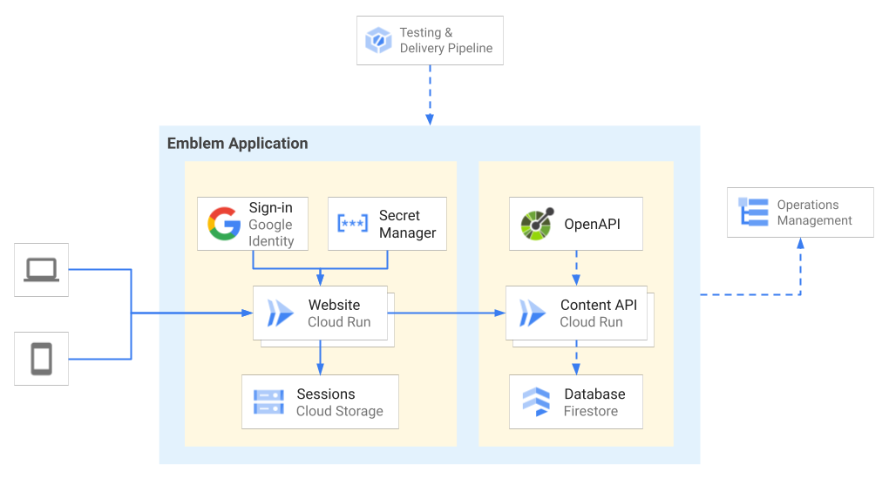

# Emblem - Content API

## Design
The Emblem Content API is configured as a Cloud Run service written using the [Flask](https://flask.palletsprojects.com/en/2.0.x/) web framework for Python. The [OpenAPI specification](./openapi.yaml) defines the operations and data for this API.

Most application developers should use the [Client Libraries](../client-libs) instead of directly sending requests to the API itself.

The Content API uses the following Google Cloud services:
- **Cloud Firestore** - stores application data
- **Cloud Logging** - creates structured log entries 

Emblem uses a testing & delivery pipeline to automate deployment of the web application (Website & Content API) and setup of operations management.

To deploy the Emblem Content API manually, either launch the [Quickstart](#quickstart) interactive tutorial or follow the[Setup](#setup) guide below.

## Quickstart

Learn how to run the API by following an interactive tutorial on Cloud Shell, a free browser-based IDE that comes preconfigured with the necessary tools to run Emblem. Click the button below to clone Emblem into a Cloud Shell instance and launch the interactive tutorial:

Once your Emblem Content API is running, you can deploy the Emblem Website to interact with the API by launching the [Website Quickstart on Cloud Shell](https://ssh.cloud.google.com/cloudshell/editor?cloudshell_git_repo=https%3A%2F%2Fgithub.com%2FGoogleCloudPlatform%2Femblem&cloudshell_tutorial=docs%2Ftutorials%2Fwebsite-quickstart.md).

## Setup

You will need to have a Google Cloud project available.
Use the [Google Cloud console](https://console.cloud.google.com/)
to prepare the test environment and run the API server.

### Prepare the Cloud Firestore database

Open the [Google Cloud console](https://console.cloud.google.com/)
in your browser.

1. [Navigate to Cloud Firestore](https://console.cloud.google.com/firestore/data)
and select *Native* mode. This can only be done once, before the database is used.
1. "Seed" the Emblem API Cloud Firestore database with the
the first _approver_. Click *Data* from the options at
the left side of the Cloud Firestore screen, then enter
the first approver:
    - Click *Start Collection*
    - Enter `approvers`, exactly as shown here, as the collection
    ID
    - Add the first approver to the collection. Do not
    enter a Document ID, Cloud Firestore will assign
    one.
    - For the first field in this first document, enter
    the *Field name* `kind` of type string with value
    `approvers`.
    - Click *Add field*, and create a field named `email`
    of type string. Use the email address of the person
    who will be the first Approver as the value.
    - Click *Add Field* and create a field named `name`
    of type string and fill in that person's name.
    - Click *Add Field* and create a field named
    `active` of type boolean, and value true.
    - Click *Save*

The person with this email address will be able to perform
all API operations as an Approver.

### Deploy the API server to Cloud Run

1. Navigate to the directory `content-api`.
1. Run the command `gcloud init` and set the email address
   to one that has permission to access the database. The
   email you used to create the project is fine. Also select
   the project you created the database in.
1. Set the variable `PROJECT_ID` to the project you selected in the previous step by running the following command:

        export PROJECT_ID=$(gcloud config get-value project)

1. Create a container for the API server using Cloud Build.

        gcloud builds submit . --tag=gcr.io/$PROJECT_ID/content-api

    This will create a container image and save it in
    a container registry.

1. Deploy to Cloud Run.

        gcloud run deploy --image=gcr.io/$PROJECT_ID/content-api

The API server will be deployed and run. Note the
URI of the new service. This URI will need to be provided to
the Emblem website when it is installed.

## Seed Database
To mimic a real-world production instance, you can seed the Firestore database with sample data. Add fake campaigns, causes, donors, and donations by running the [`seed_database`](./data/seed_database.py) script:

    python seed_database.py

This script imports content from [`sample_data.json`](./data/sample_data.json). The campaigns, causes, donors, and donations in the sample data are fictional.

Once the database has been seeded, you can interact with the data by running the [Website](../website/README.md) or by making requests to the API directly.

    # Get the URL from your deployed API.
    export EMBLEM_API_URL=$(gcloud run services describe content-api --project $PROJECT_ID --format "value(status.url)")

    # Make an HTTP request to get a "cause" entry.
    curl -X GET $EMBLEM_API_URL/causes/6aee60eead3741a98f15
