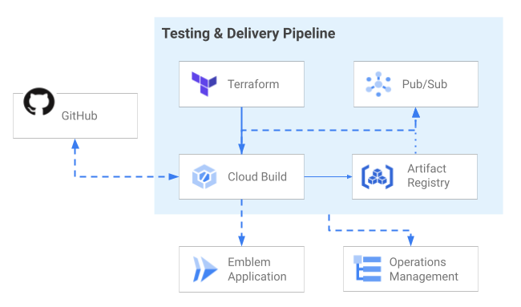
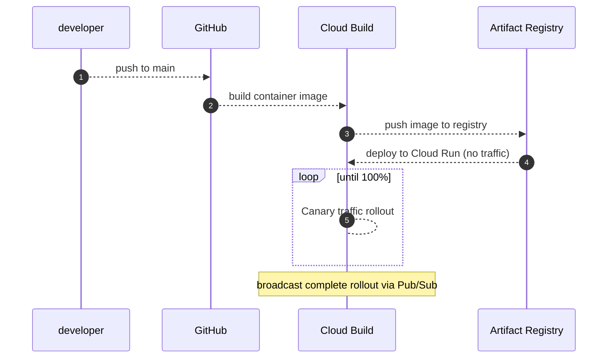
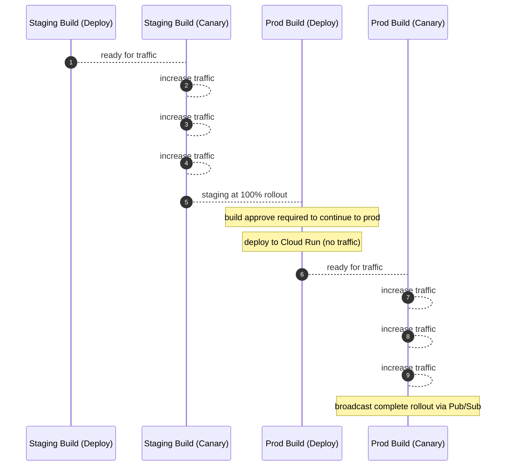
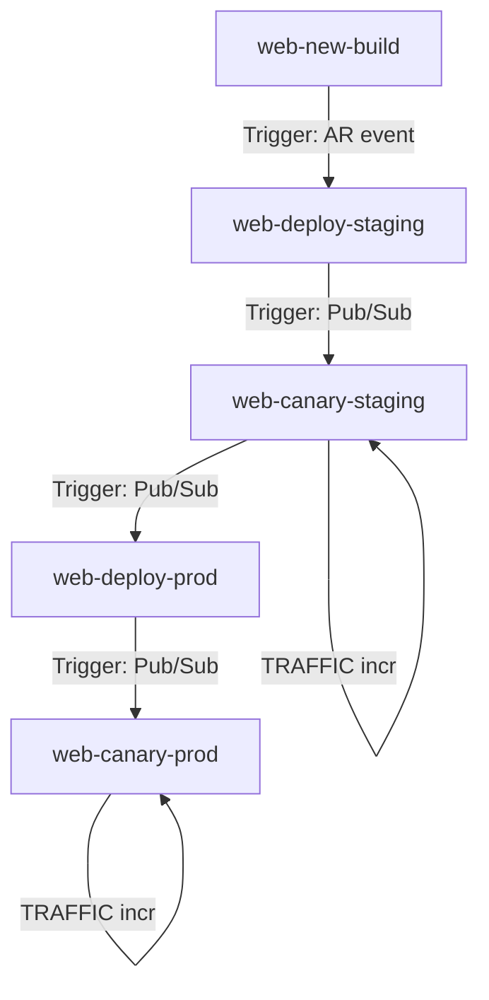
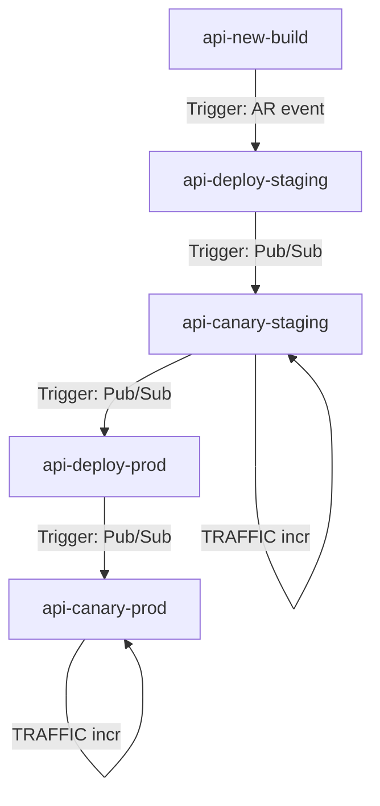

# Emblem - Delivery

The Emblem delivery system is responsible for reliably shipping code changes to production.

The code lives primarily in [terraform/](https://github.com/GoogleCloudPlatform/emblem/tree/main/terraform)
and [ops/](https://github.com/GoogleCloudPlatform/emblem/tree/main/ops).

## Design

Check out the [Shipping Software decisions](decisions#shipping-software) to review the delivery design as it evolved.

The installation tools & delivery system together combine to support two primary installation modes:

* *single-project*: Deploy a staging environment and delivery orchestration in a single project.
* *multi-environment*: Deploy delivery orchestration, a staging application instance, and a production application instance each in their own GCP project.

In both cases, a series of Cloud Build jobs are used to build a container, deploy a Cloud Run revision, then route traffic until rollout reaches 100%.

Pub/Sub is used to signal each step is complete, allowing the next step to operate.

### Single-project Delivery Flow

In this sequence, all resources are in the same project as the deployed application.

### Multi-environment Delivery Flow

The multi-environment flow extends from the single-project flow. Let's look at this as a handoff between Cloud Build operations.
In this sequence, Cloud Build and Artifact Registry are in an `ops` project, Staging is in a `staging` project, and Production is in a `prod` project.

### Cloud Build Triggers

#### Website Triggers

| Name                | Trigger       | Trigger Event          | YAML                        |  Executes trigger                                |
| ------------------- | ------------- | ---------------------- | --------------------------- | -------------------------------------------------|
| `web-new-build`     |  Repo trigger | Push to main branch    | `web-build.cloudbuild.yaml` | AR event calls Pub/Sub `gcr` topic automatically |
| `web-deploy-staging`|  AR event     | Topic `gcr`            | `deploy.cloudbuild.yaml`    | Calls PubSub topic `canary_staging`              |
| `web-canary-staging`|  Pub/Sub      | Topic `canary_staging` | `canary.cloudbuild.yaml`    | Recursively calls PubSub topic `canary_staging` and increments `TRAFFIC` |
| `web-deploy-prod`   |  Pub/Sub      | Topic `deploy_completed_staging` |`deploy.cloudbuild.yaml`    | Calls PubSub topic `canary_prod`              |
| `web-canary-prod`|  Pub/Sub      | Topic `canary_prod` | `canary.cloudbuild.yaml` | Recursively calls PubSub topic `canary_prod` and increments `TRAFFIC` |

**Note:** Health checks occur at `web-canary-staging` and `web-canary-prod`.

#### API Triggers

| Name                | Trigger       | Trigger Event          | YAML                        |  Executes trigger                                |
| ------------------- | ------------- | ---------------------- | --------------------------- | -------------------------------------------------|
| `api-new-build`     |  Repo trigger | Push to main branch    | `api-build.cloudbuild.yaml` | AR event calls Pub/Sub `gcr` topic automatically |
| `api-deploy-staging`|  AR event     | Topic `gcr`            | `deploy.cloudbuild.yaml`    | Calls PubSub topic `canary_staging`              |
| `api-canary-staging`|  Pub/Sub      | Topic `canary_staging` | `canary.cloudbuild.yaml`    | Recursively calls PubSub topic `canary_staging` and increments `TRAFFIC` |
| `api-deploy-prod`   |  Pub/Sub      | Topic `deploy_completed_staging` |`deploy.cloudbuild.yaml`    | Calls PubSub topic `canary_prod`              |
| `api-canary-prod`|  Pub/Sub      | Topic `canary_prod` | `canary.cloudbuild.yaml` | Recursively calls PubSub topic `canary_prod` and increments `TRAFFIC` |

**Note:** Health checks occur at `api-canary-staging` and `api-canary-prod`.

