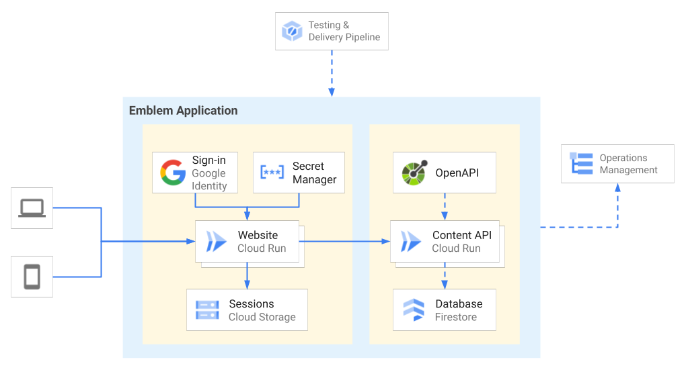

# Emblem - Website



## Design
The Emblem Website is configured as a [Cloud Run](https://cloud.google.com/run) service written using the [Flask](https://flask.palletsprojects.com/en/2.0.x/) web framework for Python.

The website uses the following Google Cloud services:
- **Google Identity** - handles user sign-in and authentication
- **Secret Manager** - manages OAuth client secrets
- **Cloud Storage** - stores session data

Emblem uses a testing & delivery pipeline to automate deployment of the web application (Website & Content API) and setup of operations management.

To deploy the Emblem Website manually, either launch the [Quickstart](#quickstart) interactive tutorial or follow the [Setup](#setup) guide below.

## Detailed Setup Guide

### Setting up authentication
>**Note:** end-user authentication is required to access some - _but not all_ - application pages.

To enable end-user authentication within the application, you'll need to create an [OAuth client ID](https://console.cloud.google.com/apis/credentials/oauthclient) and configure an [OAuth consent screen](https://console.cloud.google.com/apis/credentials/consent). If you don't already have an OAuth client set up, you can run the Emblem [configure_auth](./scripts/configure_auth.sh) script in your terminal: 
```bash
sh ./scripts/configure_auth.sh
```

### Configuration
To configure the app, set the following environment variables:

| **Variable name**       | **Description**                                           |
| ----------------------- | --------------------------------------------------------- |
| `CLIENT_ID`             | The client ID of your OAuth 2.0 client.               |
| `CLIENT_SECRET`         | The client secret of your OAuth 2.0 client.           |
| `REDIRECT_URI`          | A redirect_uri authorized for your OAuth 2.0 client   |
| `EMBLEM_API_URL`        | A URL pointing to your instance of the Emblem Content API |
| `EMBLEM_SESSION_BUCKET` | The name of your [Cloud Storage bucket](https://cloud.google.com/storage/docs/key-terms#buckets). |

The `CLIENT_ID` and `CLIENT_SECRET` can be found in the details page of your [Credentials dashboard](https://console.cloud.google.com/apis/credentials).

> **Note: these are sensitive values that should be kept secure.** When deployed with the production pipeline, Emblem uses Secret Manager to store these values more securely.

The `EMBLEM_API_URL` value will be determined by where you host the Content API. (If you're using Cloud Run, it will look something like `https://<SERVICE_NAME>-<HASH>.run.app`)

Congratulations! You are now ready to run the Emblem web app.

## Seeding the Database
To mimic a real-world production instance, you can deploy the [Content API](../content-api/README.md) and seed the Firestore database with sample data. Add fake campaigns, causes, donors, and donations by running the [`seed_database`](../content-api/data/seed_database.py) script:
```
python seed_database.py
```

This script imports content from [`sample_data.json`](../content-api/data/sample_data.json). The campaigns, causes, donors, and donations in the sample data are fictional.

Once the database has been seeded, you can interact with the data on your running Website instance or by making requests to the API directly.
```
# Get the URL from your deployed API.
# If the API is running locally, set EMBLEM_API_URL to your local API URL.
export EMBLEM_API_URL=$(gcloud run services describe content-api --project $PROJECT_ID --format "value(status.url)")

# Make an HTTP request to get a cause
curl -X GET $EMBLEM_API_URL/causes/6aee60eead3741a98f15
```
