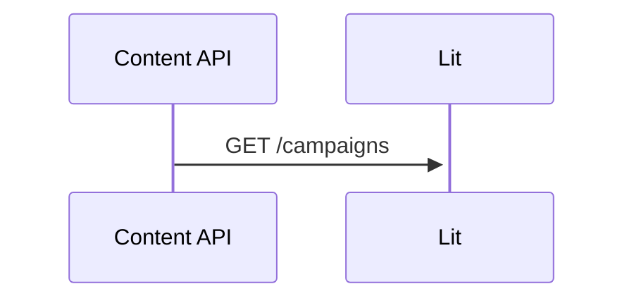
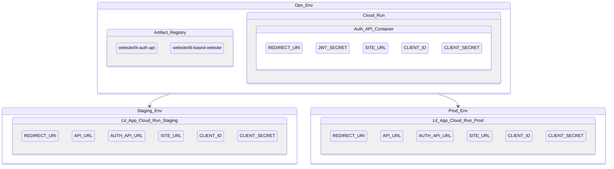

# Emblem Giving frontend application

## Quicklinks
* [Requirements](requirements)
* [Set Up](#set-up)
* [Learning](requirements)
* [Code of Conduct](#code-of-conduct)

## Requirements

* Please have [node](https://nodejs.org/en/ ) 14 & npm 8 or higher installed.
* Have basic Emblem 3 project setup. Please see root README. 
* Enable Cloud Firestore in both Staging and Prod environments
* Ensure that your compute service account (compute) for each ops project has secret manager accessor role so it can access the secrets located in ops project

**You will end up with 2 new containers:**
* `lit-based-website` (Lit web app)
* `lit-auth-api` (Auth Node.js Server)

## Set Up
Set your local environment in Cloud Shell with the following environment vars:

```bash
export PROD_PROJECT=your-project-prod
export STAGE_PROJECT=your-project-stage
export OPS_PROJECT=your-project-ops
```

## Develop App Locally



**Have the python backend running locally by:**
```bash
cd content-api/
pip3 install -r requirements.txt
python main.py 
```
Starts up at `localhost:8080`. 
Verify the backend is running correctly by heading to your browser and seeing the output `localhost:8080/campaigns`.

**Once the above is verified, now you are ready to start running the app by:**

```bash
npm install // Install app dependencies
npm build  // Bundle the app
npm run start // Runs the app locally!
```

Open your browser to `localhost:8000`.

Ready, Set, Develop!


## Container Deployment



## Build Images  

### Lit container

```bash
cd client-app/
gcloud set project $OPS_PROJECT // All images are in this registry
gcloud builds submit --tag $REGION-docker.pkg.dev/ $OPS_PROJECT/website/lit-based-website
```

### Auth server container

```bash
cd server/
gcloud set project $OPS_PROJECT // All images are in this registry
gcloud builds submit --tag $REGION-docker.pkg.dev/$OPS_PROJECT/website/lit-auth-api
```

## Deploying both containers

### Lit container

```bash
cd client-app/
gcloud set project $STAGE_PROJECT // Or $PROD_PROJECT
Artifact Registry we will be using lives here. All images are in this registry
gcloud run deploy --image=$REGION-docker.pkg.dev/$OPS_PROJECT/website/lit-based-website --port 8000
```

### Auth server container

```bash
cd server/
gcloud set project $OPS_PROJECT 
gcloud run deploy --image=$REGION-docker.pkg.dev$OPS_PROJECT/website/lit-auth-api --port 4000
```

List of required environment variables and secrets needed to update each Cloud Run container in order to function properly. 

| Env Vars       | Description                                 | Example                                    |
| -------------- | ------------------------------------------- | ------------------------------------------ |
| API_URL        | path that points to server api              | `https://content-api-abc123-uc.a.run.app`  |
| SITE_URL       | path that points to current client web app  | `https://lit-website-abc123-uc.a.run.app`  |
| AUTH_API_URL   | path that points to nodejs auth api url     | `https://lit-auth-api-abc123-uc.a.run.app` |
| REDIRECT_URI   | path that points to AUTH_API_URL callback   | `${AUTH_API_URL}/auth/google`              |

| Secrets        | Description                                                                                      |                                                                                  |
| -------------- | ------------------------------------------------------------------------------------------------ | -------------------------------------------------------------------------------- |
| JWT_SECRET     | String to encode [jwt token](https://jwt.io/introduction) (only required for auth api container) | `some-arbitrary-string`                                                     |
| CLIENT_ID      | OAuth 2.0 credentials client id                                                                  | From [web client credentials](https://console.cloud.google.com/apis/credentials) |
| CLIENT_SECRET  | OAuth 2.0 credentials client secret                                                              | From [web client credentials](https://console.cloud.google.com/apis/credentials) |

### Lit container

Set your `gcloud` config to which staging or production environment where your Lit container was deployed to before updating
the container with the following variables.

```bash
gcloud set project $STAGE_PROJECT // Or $PROD_PROJECT

gcloud run services update lit-based-website \
  --update-env-vars REDIRECT_URI=$(your-redirect-uri) \
  --update-env-vars API_URL=$(your-api-url) \
  --update-env-vars AUTH_API_URL=$(your-auth-api-url) \
  --update-env-vars SITE_URL=$(your-client-site-url) \
  --update-secrets CLIENT_ID=$(your-client-id) \
  --update-secrets CLIENT_SECRET=$(your-client-secret)
```

### Auth server container

Set your `gcloud` config to the operations ($OPS_PROJECT) environment where your Auth API server container was deployed to before updating
the container with the following variables.

**Note:** Your operations Google Cloud project's compute service account should have assigned role, Secret Manager Secret Accessor. [Ref](https://cloud.google.com/run/docs/configuring/secrets)

```bash
gcloud set project $OPS_PROJECT 

gcloud run services update lit-auth-api \
--update-env-vars REDIRECT_URI=$(your-redirect-uri) \
--update-env-vars JWT_SECRET=$(your-jwt-secret) \
--update-env-vars SITE_URL=$(your-client-site-url) \
--update-secrets CLIENT_ID=$(your-client-id) \ 
--update-secrets CLIENT_SECRET=$(your-client-secret)

```

## Learning

Want to learn more frontend [resources](docs/resources.md)? This includes tooling used for this project.

## Code of Conduct

Please read through our [code of conduct](docs/code_of_conduct.md)
