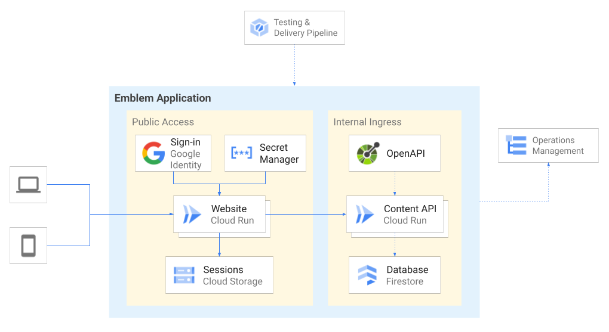

# Emblem - Website

## Design
The Emblem Website is configured as a Cloud Run service written using the [Flask](https://flask.palletsprojects.com/en/2.0.x/) web framework for Python.

The website uses the following Google Cloud services:
- **Google Identity** - handles user sign-in and authentication
- **Secret Manager** - manages OAuth client secrets
- **Cloud Storage** - stores session data

Emblem uses a testing & delivery pipeline to automate deployment of the web application (Website & Content API) and setup of operations management.

To deploy the Emblem Website manually, either launch the [Quickstart](#quickstart) interactive tutorial or follow the[Setup](#setup) guide below.

## Quickstart

Learn how to run the website by following an interactive tutorial on Cloud Shell, a free browser-based IDE that comes preconfigured with the necessary tools to run Emblem. Click the button below to clone Emblem into a Cloud Shell instance and launch the interactive tutorial:

> Note: some elements of the website will not function without a deployed instance of the Emblem Content API. Learn how to run the Content API by launching the [API Quickstart on Cloud Shell](https://ssh.cloud.google.com/cloudshell/editor?cloudshell_git_repo=https%3A%2F%2Fgithub.com%2FGoogleCloudPlatform%2Femblem&cloudshell_tutorial=docs%2Ftutorials%2Fapi-quickstart.md).

## Setup

### Downloading tools
To run this project, you'll need the following tools:

* Python (3.8 or higher)
* [pip](https://pypi.org/project/pip/)

The following tools are optional, but recommended:

* [pyenv](https://github.com/pyenv/pyenv)

### Installing dependencies
To install dependencies for the website, `cd` into the `website` directory and
run `pip install -r requirements.txt`.

### Setting up authentication
To enable end-user authentication within the application, you'll need to create an [OAuth client ID](https://console.cloud.google.com/apis/credentials/oauthclient) and configure an [OAuth consent screen](https://console.cloud.google.com/apis/credentials/consent). If you don't already have an OAuth client set up, you can run the Emblem [configure_auth](./scripts/configure_auth.sh) script in your terminal.

>**Note:** end-user authentication is required to access some - _but not all_ - application pages.

### Configuration
To configure the app, set the following environment variables:

| **Variable name**       | **Description**                                           |
| ----------------------- | --------------------------------------------------------- |
| `CLIENT_ID`             | The client ID of your OAuth 2.0 client.               |
| `CLIENT_SECRET`         | The client secret of your OAuth 2.0 client.           |
| `EMBLEM_API_URL`        | A URL pointing to your instance of the Emblem Content API |
| `EMBLEM_SESSION_BUCKET` | The name of your [Cloud Storage bucket](https://cloud.google.com/storage/docs/key-terms#buckets). |

The `CLIENT_ID` and `CLIENT_SECRET` can be found in the details page of your [Credentials dashboard](https://console.cloud.google.com/apis/credentials).

> **Note: these are sensitive values that should be kept secure.** When deployed with the production pipeline, Emblem uses Secret Manager to store these values more securely.

The `EMBLEM_API_URL` value will be determined by where you host the Content API. (If you're using Cloud Run, it will look something like `https://<SERVICE_NAME>-<HASH>.run.app`)

Congratulations! You are now ready to run the Emblem web app.

### Running

To run the website, use the `flask run` command. By default, the website will run on port `8080`.